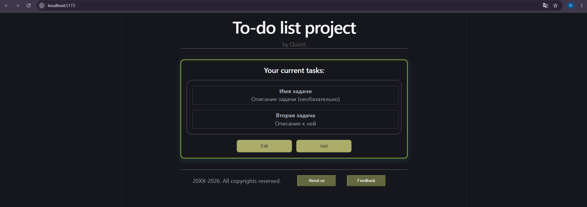
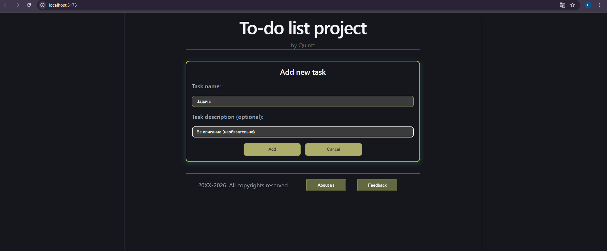
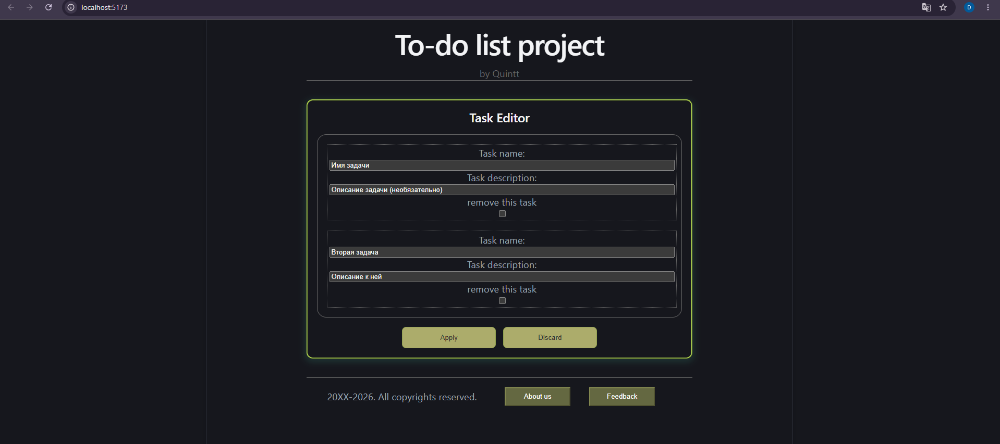

# To-Do List

Небольшой SPA-проект на React для создания и управления списком задач.  
Проект демонстрирует работу с состоянием, пользовательским вводом и сохранением данных в браузере.

## Скриншот





## Функционал

- Добавление новых задач.
- Удаление задач.
- Сохранение заметок в `localStorage`.
- Автоматическое восстановление списка после обновления страницы.
- Простой и понятный интерфейс.

## Стек

- React.
- Vite.
- LocalStorage.

## Как запустить

```bash
git clone https://github.com/Dreact61/todo-list.git
cd todo-list
npm install
npm run dev
```

## Что реализовано

В проекте показана базовая логика SPA-приложения: работа со списком задач, изменение состояния, сохранение данных между перезагрузками и отображение актуального интерфейса без серверной части.

## Планы по развитию

- Добавить фильтры задач.
- Добавить дату создания задачи.
- Улучшить визуальное оформление.
